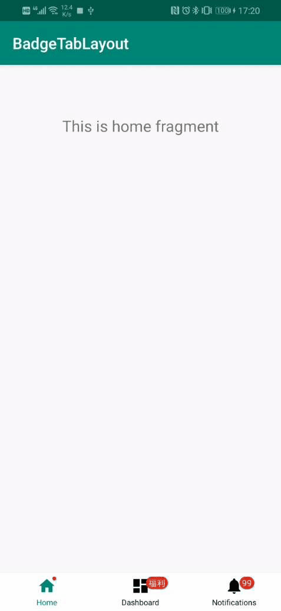

BadgeTabLayout
======================

支持小红点/未读数/文本Badge的tab，类似于**RadioGroup**+**RadioButton**，适用于首页的底部多tab导航。

## 由来
项目前期使用的是**RadioGroup**+**RadioButton**，但是碰到要加小红点/未读消息数这样的需求，做法是直接在上面盖一个View，位置调整好就行，但是我觉得这样不太优雅。所以，我copy了RadioGroup、RadioButton的源码进行了重构，支持图标+文字+角标

## 安装包
[点我下载安装](app-debug.apk)

## 效果
  

## 用法
跟RadioGroup的用法几乎一致，具体看查demo（app module）

### 设置监听器
```java
BadgeTabLayout tabLayout = findViewById(R.id.tabLayout);
tabLayout.setOnCheckedChangeListener(new BadgeTabLayout.OnCheckedChangeListener() {
    @Override
    public void onCheckedChanged(BadgeTabLayout group, int checkedId) {
        ...
    }
});

```

### 布局文件

```xml
<?xml version="1.0" encoding="utf-8"?>
<com.mutou.badgetab.BadgeTabLayout xmlns:android="http://schemas.android.com/apk/res/android"
    xmlns:app="http://schemas.android.com/apk/res-auto"
    android:id="@+id/tabLayout"
    android:layout_width="match_parent"
    android:layout_height="?attr/actionBarSize"
    android:background="@android:color/white"
    android:orientation="horizontal"
    app:checkedTab="@id/homeTabView">

    <com.mutou.badgetab.BadgeTabView
        android:id="@+id/homeTabView"
        style="@style/BadgeTabView.Home"
        app:badge_visible="true"
        app:src="@drawable/selector_ic_home"
        app:text="@string/title_home" />

    <com.mutou.badgetab.BadgeTabView
        android:id="@+id/dashboardTabView"
        style="@style/BadgeTabView.Home"
        app:badge_text="福利"
        app:badge_visible="true"
        app:src="@drawable/selector_ic_dashboard"
        app:text="@string/title_dashboard" />

    <com.mutou.badgetab.BadgeTabView
        android:id="@+id/notificationsTabView"
        style="@style/BadgeTabView.Home"
        app:badge_text="99"
        app:badge_visible="true"
        app:src="@drawable/selector_ic_notifications"
        app:text="@string/title_notifications" />

</com.mutou.badgetab.BadgeTabLayout>
```

library中提供了通用的style

```xml
<resources>

    <style name="BadgeTabView_Badge">
        <item name="badge_background">@drawable/shape_bg_badge</item>
        <item name="badge_minWH">5dp</item>
        <item name="badge_minWH_withText">16dp</item>
        <item name="badge_textColor">@android:color/white</item>
        <item name="badge_textSize">11dp</item>
        <item name="badge_marginLeft">-5dp</item>
    </style>

    <style name="BadgeTabView" parent="BadgeTabView_Badge">
        <item name="android:layout_width">0dp</item>
        <item name="android:layout_height">wrap_content</item>
        <item name="android:layout_weight">1</item>
        <item name="src_marginTop">5dp</item>
        <!--textColor不提供默认的，还是由上层去定义吧-->
        <!--<item name="textColor">@color/selector_color_home_tab</item>-->
        <item name="textSize">10dp</item>
        <item name="text_marginBottom">5dp</item>
        <item name="text_marginTop">2dp</item>
    </style>

</resources>
```

demo中提供了一个APP特例的style

```xml
<resources>

    <style name="BadgeTabView.Home">
        <item name="textColor">@color/selector_color_home_tab</item>
    </style>

</resources>
```

style不适用项目的话可以不用，自己写一个。

